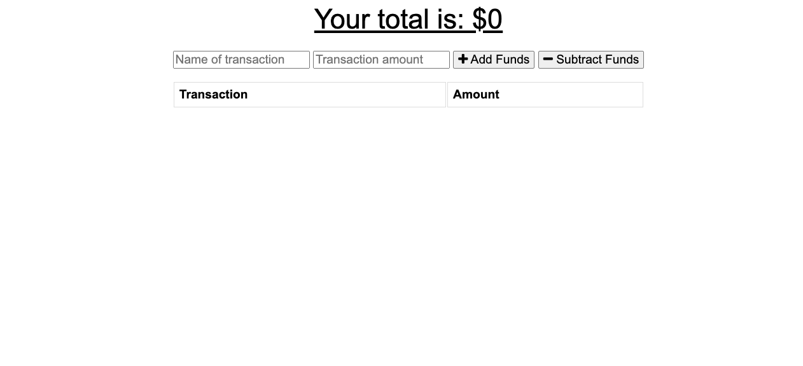

# Budget Tracker [](https://github.com/sindresorhus/awesome#readme)  

  ## Description  
  The current project is a tracker that is able to display in real time transactions and has offline capabilities. For when the wifi cuts off, it will save the new transation in an indexDB and when going online will post to the database.

  ## Table of Contents  
  - [Description](#description)
  - [Installation](#installation)  
  - [Usage](#usage)  
  - [License](#license)  
  - [Contributing](#contributing)  
  - [Test](#test)  
  - [Questions](#questions) 
  - [Images](#images) 
  - [Deployed Application](#deployed-application)
 
  ## Installation  

  ```
  npm i 
  ```
  ## Usage  

  ```
  npm start   
  ```   
  Refer to the ScreenShots in the images section to see what the application looks like.
  ## License  
  
    

  ## Contributing  

  No contributors yet  

  ## Test   
  No test currently

 
  ## Questions  

  Please email me directly for any questions. 

  ## Deployed Application  
  [Link To app](https://limitless-tundra-87522.herokuapp.com/)
  ## Images  
    